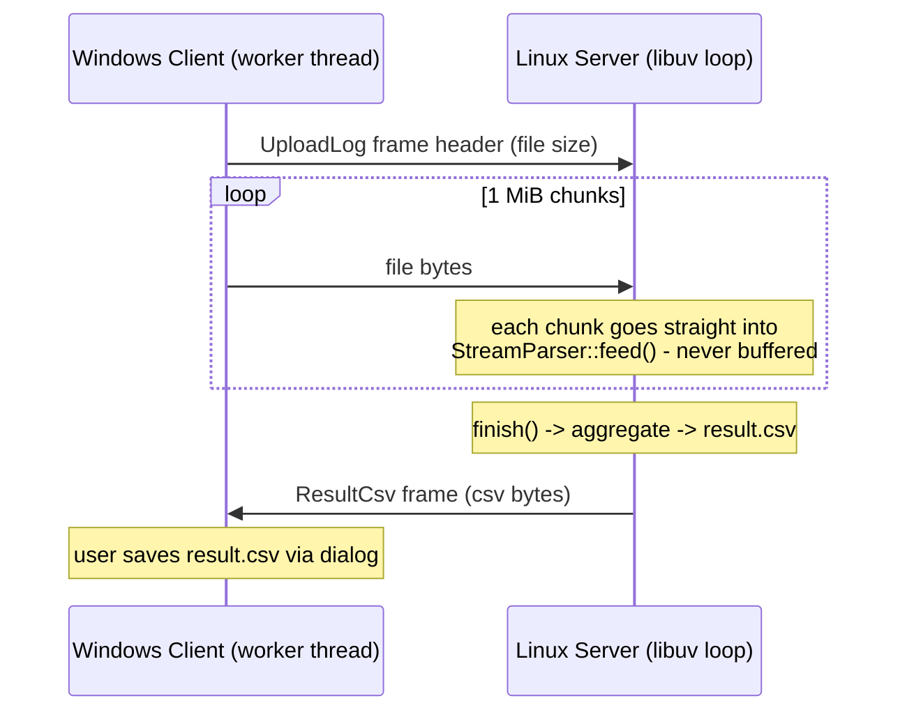

# Large-Scale Log Analysis & Transfer System

A client-server system that uploads a ~500 MB radar log file from a Windows
GUI client to a Linux server over TCP. The server parses the stream **while
receiving it**, aggregates statistics, and returns `result.csv` to the client.

- **Client**: C++17, Dear ImGui (Win32 + DirectX 11), worker-thread I/O
- **Server**: C++17, libuv event loop, single process
- **Protocol**: TCP with a 16-byte length-prefixed framing header

## Repository Layout

```
├── common/            # wire protocol shared by client & server
│   └── Protocol.h
├── server/            # Linux server (libuv)
│   ├── LineParser.h   #   stateless, non-throwing line parser
│   ├── StreamParser.h #   chunk reassembly + statistics + CSV
│   ├── Session.h      #   per-connection state machine
│   ├── TcpServer.h    #   listener, owns sessions via unique_ptr
│   ├── Logger.h, main.cpp
│   └── tests/         #   parser unit test + CLI test client
├── client/            # Windows GUI client (Dear ImGui + DX11)
│   ├── NetClient.h    #   worker-thread uploader (WinSock, RAII)
│   └── main.cpp
└── bin/               # prebuilt binaries (log_server, log_client.exe)
```

## Build Instructions

### Server (Linux)

Requirements: GCC 11+ (C++17), CMake 3.16+. libuv is used from the system
package if present (`apt install libuv1-dev`), otherwise CMake fetches and
builds v1.48.0 automatically.

```bash
cmake -B build -DCMAKE_BUILD_TYPE=Release
cmake --build build -j
./build/server/log_server [--port 5555] [--bind 0.0.0.0] [--daemon]
                          [--log server.log] [--csv result.csv]
```

`--daemon` detaches the process into the background (output goes to the
`--log` file). Stop it gracefully with `SIGTERM`.

> **Note for WSL users**: WSL shuts down its VM shortly after the last
> process exits, which can silently take a freshly daemonized server down
> with it. When testing under WSL, prefer running the server in the
> foreground in a terminal you keep open (just omit `--daemon`), or verify
> the port after starting: `ss -tln | grep 5555`. On a regular Linux host
> `--daemon` behaves normally.

Run the parser unit tests (uses the provided sample log):

```bash
./build/server/parser_test Test_Log.log
```

### Client (Windows)

Requirements: Visual Studio 2022 (MSVC C++ workload), CMake 3.16+.
Dear ImGui v1.91.8 is fetched automatically at configure time.

```powershell
cmake -S client -B build-client
cmake --build build-client --config Release
# -> build-client\Release\log_client.exe  (statically linked CRT, single exe)
```

Usage: pick the log file with **Browse**, press **Upload**, watch the
progress bar, then **Save result.csv** once the state reaches *done*.
**Cancel** aborts an in-flight transfer safely.

## Network Architecture

Every message is one length-prefixed frame — no delimiters, no ambiguity,
and the receiver always knows exactly how many bytes remain:

```
+--------------+-----+------+----------+---------------------+----------------+
| magic "BLOG" | ver | type | reserved | payloadSize (8B LE) | payload ...    |
+--------------+-----+------+----------+---------------------+----------------+
   4 bytes       1     1        2            8                 payloadSize
```



- The server is a single-threaded libuv event loop; each connection is a
  `Session` object owned by `TcpServer` through `std::unique_ptr` and
  destroyed only after libuv confirms the handle closed — use-after-free is
  impossible by construction.
- The client performs all socket I/O on a worker `std::thread`; the UI
  thread only polls atomics, so the window never freezes during the upload.

### Robustness on disconnect

- Server: a read error (`ECONNRESET`, EOF mid-payload) is logged and the
  session is closed and reclaimed; the server keeps serving. Verified by
  hard-closing the socket after 200 MB — the very next upload succeeded and
  produced a byte-identical CSV.
- Client: all blocking calls carry a 30 s `SO_SNDTIMEO`/`SO_RCVTIMEO`;
  a lost connection surfaces as a failed `send`/`recv`, the worker logs it,
  the RAII socket wrapper releases the handle, and the UI shows *failed*.
  Cancel calls `shutdown()` on the socket, which unblocks the worker
  immediately. `SIGPIPE` is ignored on the POSIX side.

## Memory Optimization Strategy

The 500 MB file is **never** held in memory, on either side:

- The client reads and sends the file in 1 MiB chunks.
- The server hands every received chunk directly to `StreamParser::feed()`.
  Only the trailing partial line of each chunk (the carry buffer) survives
  between calls, so state is one line + the statistics map.
- A poison "line" that never ends is capped: if the carry buffer exceeds
  1 MiB without a newline it is dropped as one malformed line and the
  parser resynchronizes at the next `\n`.
- Statistics are running aggregates (count map + sum/count for the average),
  so memory is independent of line count.

**Measured** (full 483 MiB upload, `/usr/bin/time -v`):

```
Maximum resident set size: 4,456 KB   (limit: 50 MB -> 8.9% used)
```

**Leak check** (valgrind, full scenario: upload + mid-transfer abort +
SIGTERM shutdown):

```
definitely lost: 0 bytes   indirectly lost: 0 bytes   possibly lost: 0 bytes
ERROR SUMMARY: 0 errors from 0 contexts
```

No `new`/`delete`/`malloc`/`free` appears anywhere in the sources; all
dynamic memory is owned by STL containers, `std::unique_ptr`, or (on the
client) `Microsoft::WRL::ComPtr` for D3D COM objects.

## Corrupted ("Poison") Data Handling

`LineParser::parse()` is stateless and non-throwing: it returns
`std::optional<ParsedLine>` and rejects a line on **any** structural
violation (two-stage validation):

1. **Structural**: fixed-width timestamp with separator/digit/hour-range
   checks, three numeric `[n]` fields, `BYDA::<Module>:` prefix.
2. **Semantic**: if a `spd[...]` field is present but unparseable,
   unterminated, negative, or physically implausible (`>= 1e9`), the whole
   line is treated as corrupt — poison values can never contaminate the
   average. (Normal values sit around `1.4e5`; the injected poison was
   `8.9e20`, which would have dominated the mean by 15 orders of magnitude.)

Malformed lines are counted, logged (line number + first 120 chars), and
parsing continues to the end of the stream. Chunk boundaries are handled by
the carry buffer, verified by a test that feeds the whole file in 7-byte
chunks and requires results identical to a single-chunk run.

**Measured on the provided 500 MB file** (3,483,528 lines):

| corruption type                   | lines |
|-----------------------------------|------:|
| garbage insertion (no structure)  | 5     |
| missing opening bracket           | 2     |
| missing closing bracket           | 6     |
| out-of-range `spd` (~8.9e20)      | 6     |
| **total skipped**                 | **19**|

Result: `parsed_lines = 3,483,509`, `average_speed = 137500.000000`
(with poison included the average would have been ~9.2e15).

## result.csv Format

```csv
section,date_hour,module,count
module_count,2026-06-19 22,RadarTrackNodeState,21458
...
summary,average_speed,,137500.000000
summary,parsed_lines,,3483509
summary,skipped_lines,,19
```

Task 1 rows (`module_count`) group occurrences by (date+hour, module);
summary rows carry the Task 2 average and the parse accounting.
