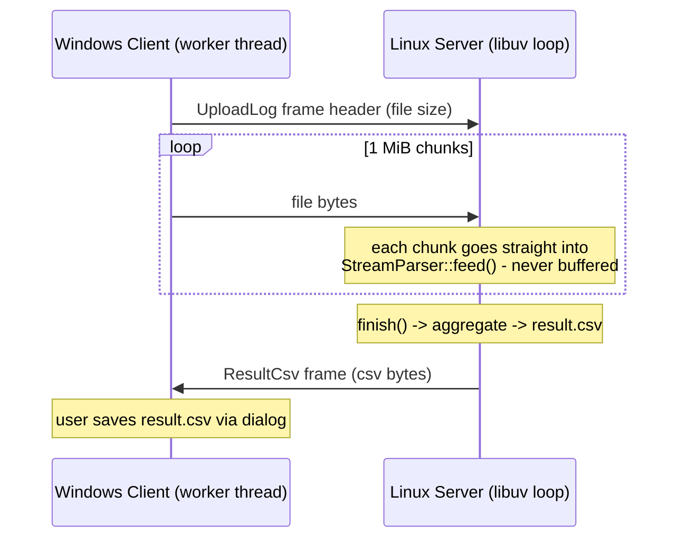

# Large-Scale Log Analysis & Transfer System

A client-server system that uploads a ~500 MB radar log file from a Windows
GUI client to a Linux server over TCP. The server parses the stream **while
receiving it**, aggregates statistics, and returns `result.csv` to the client.

- **Client**: C++17, Dear ImGui (Win32 + DirectX 11), worker-thread I/O
- **Server**: C++17, libuv event loop (single loop thread) + a dedicated
  log-writer thread + libuv's thread pool for the result.csv file write
- **Protocol**: TCP with a 16-byte length-prefixed framing header

## Repository Layout

```
├── common/            # wire protocol shared by client & server
│   └── Protocol.h
├── server/            # Linux server (libuv)
│   ├── LineParser.h   #   stateless, non-throwing line parser
│   ├── StreamParser.h #   chunk reassembly + statistics + CSV
│   ├── Session.h      #   per-connection state machine
│   ├── TcpServer.h    #   listener, owns sessions via unique_ptr
│   ├── Logger.h       #   async logger: bounded queue + writer thread
│   ├── CsvWriter.h    #   result.csv copy via uv_queue_work (thread pool)
│   ├── main.cpp
│   └── tests/         #   parser + logger unit tests, CLI test client
├── client/            # Windows GUI client (Dear ImGui + DX11)
│   ├── NetClient.h    #   worker-thread uploader (WinSock, RAII)
│   └── main.cpp
├── bin/               # prebuilt binaries (log_server, log_client.exe)
├── run_server.sh      # start the prebuilt server (Linux / WSL)
└── run_server.bat     # same, double-click from Windows (runs inside WSL)
```

## Build Instructions

### Server (Linux)

Requirements: GCC 11+ (C++17), CMake 3.16+. libuv is used from the system
package if present (`apt install libuv1-dev`), otherwise CMake fetches and
builds v1.48.0 automatically.

```bash
cmake -B build -DCMAKE_BUILD_TYPE=Release
cmake --build build -j
./build/server/log_server [--port 5555] [--bind 0.0.0.0] [--daemon]
                          [--log server.log] [--csv result.csv]
                          [--idle-timeout 60]
```

`--idle-timeout SEC` closes a connection that makes no progress for that
long (default 60 s, `0` disables) — see *Robustness on disconnect*.

**Launchers.** To start the prebuilt server with defaults (port 5555, CSV
copy to `./result.csv`, log to the console) without typing the path:
`./run_server.sh` on Linux/WSL, or double-click `run_server.bat` on Windows,
which starts the server inside WSL from the repository's location. Both pass
extra options through, e.g. `run_server.bat --port 6000`.

**Prebuilt binary.** `bin/log_server` is a fully static x86-64 build
(`-static`, libuv compiled in via FetchContent) so it runs on any Linux
without installing libuv, and independently of the host's glibc/libstdc++
versions. To reproduce it:

```bash
cmake -B build-static -DCMAKE_BUILD_TYPE=Release -DLOG_SERVER_STATIC=ON
cmake --build build-static --target log_server -j
strip build-static/server/log_server
```

(The linker prints two warnings about `getpwuid_r`/`getgrgid_r` in static
binaries; they come from libuv's `uv_os_get_passwd` helpers, which this
server never calls.)

`--daemon` detaches the process into the background (output goes to the
`--log` file). Stop it gracefully with `SIGTERM`.

`--bind` takes an IPv4 literal (`0.0.0.0`, `127.0.0.1`). A hostname or a
malformed address is rejected with a non-zero exit code rather than being
silently downgraded to "listen on every interface".

> **Note for WSL users**: WSL shuts down its VM shortly after the last
> process exits, which can silently take a freshly daemonized server down
> with it. When testing under WSL, prefer running the server in the
> foreground in a terminal you keep open (just omit `--daemon`), or verify
> the port after starting: `ss -tln | grep 5555`. On a regular Linux host
> `--daemon` behaves normally.

Run the parser unit tests. The stream test needs a log file; `Test_Log.log`
is the 500 MB sample supplied with the assignment and is deliberately **not**
committed (it exceeds GitHub's file size limit), so copy it into the repo root
first — any log in the same format works:

```bash
./build/server/parser_test Test_Log.log
./build/server/logger_test
```

### Client (Windows)

Requirements: Visual Studio 2022 (MSVC C++ workload), CMake 3.16+.
Dear ImGui v1.91.8 is fetched automatically at configure time.

```powershell
cmake -S client -B build-client
cmake --build build-client --config Release
# -> build-client\Release\log_client.exe  (statically linked CRT, single exe)
```

Usage: pick the log file with **Browse** (or drag & drop it onto the
window), press **Upload**, and watch the progress bar with live transfer
speed / ETA / elapsed time. When the state reaches *done* the client shows
an **analysis summary panel** (average speed, parsed/skipped lines with the
per-reason breakdown) parsed from the received CSV; the file is auto-saved
next to the selected log (toggleable) and **Save result.csv...** stores a
copy anywhere else. **Cancel** aborts an in-flight transfer safely, and
socket failures surface as human-readable messages
(`connect failed: server not reachable - is it running? (WSA 10061)`).
The **Activity log** pane lists events newest-first and can be emptied with
**Clear log**.

> Build the client on a local drive. From a `\\wsl.localhost\...` path
> Windows git refuses to clone Dear ImGui ("dubious ownership") and MSBuild
> cannot track dependencies on a network share; copy `client/` and `common/`
> side by side to e.g. `C:\logclient\` and run the two commands there.

## Network Architecture

Every message is one length-prefixed frame — no delimiters, no ambiguity,
and the receiver always knows exactly how many bytes remain:

```
+--------------+-----+------+----------+---------------------+----------------+
| magic "BLOG" | ver | type | reserved | payloadSize (8B LE) | payload ...    |
+--------------+-----+------+----------+---------------------+----------------+
   4 bytes       1     1        2            8                 payloadSize
```



- All socket handling and parsing runs on one libuv loop thread; each
  connection is a `Session` object owned by `TcpServer` through
  `std::unique_ptr` and destroyed only after libuv confirms the handle closed
  — use-after-free is impossible by construction.
- The client performs all socket I/O on a worker `std::thread`; the UI
  thread only polls atomics, so the window never freezes during the upload.

### Threading model (hybrid: one loop, blocking I/O moved off it)

The rule is "the event loop never waits on disk". Parsing stays on the loop
(≈80 µs per 64 KiB chunk, 0.6 s for the whole file — far below the point
where a worker would pay for itself, and it keeps session lifetime trivial).
The two things that *can* block are delegated:

| work                    | where it runs                         | mechanism                                  |
|-------------------------|---------------------------------------|--------------------------------------------|
| socket I/O + parsing    | loop thread                           | libuv callbacks → `StreamParser::feed()`   |
| log file writes         | dedicated writer thread (`Logger`)    | producer/consumer: bounded queue (50k lines), writer drains in batches every 5 ms, one flush per batch |
| result.csv copy         | libuv thread pool (`CsvWriter`)       | `uv_queue_work`; completion logged back on the loop |

`Logger` is created before and destroyed after everything else in `main()`,
so its destructor drains the queue and joins the writer — nothing queued is
lost on `SIGTERM`. If the queue ever fills (disk stall), the producer blocks
rather than dropping lines. `CsvWriter` owns each in-flight job via
`std::unique_ptr` and erases it in the after-work callback, the same pattern
`TcpServer` uses for sessions; `uv_run()` does not return while a job is
pending, so no job outlives its owner.

Why not wake the writer per log line? Measured: a `notify_one()` per line
puts a futex syscall on the loop thread and was *slower* than the old
synchronous write (1.4 s vs 0.87 s per upload on a 5 %-corrupt file). The
5 ms polling writer removes that cost entirely:

```
500 MB upload, 5 % of lines corrupted (174k WARN lines per upload), loopback:
  synchronous per-line flush (old):  0.84 s/upload   peak RSS 4.4 MB
  async logger (this version):       0.71 s/upload   peak RSS 5.1 MB
500 MB clean file (19 WARN lines):    0.60 s either way
```

Checked with ThreadSanitizer (0 reports) and valgrind (0 bytes in use at
exit, 0 errors) on an upload + mid-transfer abort + SIGTERM scenario.

### Robustness on disconnect

- Server: a read error (`ECONNRESET`, EOF mid-payload) is logged and the
  session is closed and reclaimed; the server keeps serving. Verified by
  hard-closing the socket after 200 MB — the very next upload succeeded and
  produced a byte-identical CSV.
- Server, silent peer: a client that vanishes without FIN/RST (power loss,
  pulled cable, NAT eviction) or connects and never sends produces no
  socket error at all, so each session also carries a libuv idle timer
  (`--idle-timeout`, default 60 s) that is re-armed on every received
  chunk. When it fires the session is closed through the same path as a
  read error, so a long-running daemon cannot accumulate zombie sessions
  and leak file descriptors. Verified under valgrind: two stalled
  connections (no bytes / 5-byte partial header) were reclaimed after the
  timeout while a concurrent upload completed normally — no leaks.
- Client: all blocking calls carry a 30 s `SO_SNDTIMEO`/`SO_RCVTIMEO`;
  a lost connection surfaces as a failed `send`/`recv`, the worker logs it,
  the RAII socket wrapper releases the handle, and the UI shows *failed*.
  Cancel calls `shutdown()` on the socket, which unblocks the worker
  immediately. `SIGPIPE` is ignored on the POSIX side.

## Memory Optimization Strategy

The 500 MB file is **never** held in memory, on either side:

- The client reads and sends the file in 1 MiB chunks.
- The server hands every received chunk directly to `StreamParser::feed()`.
  Only the trailing partial line of each chunk (the carry buffer) survives
  between calls, so state is one line + the statistics map.
- A poison "line" that never ends is capped: if the carry buffer exceeds
  1 MiB without a newline it is dropped as one malformed line and the
  parser resynchronizes at the next `\n`. It is counted exactly once no
  matter how many `feed()` calls it spans.
- Statistics are running aggregates (count map + sum/count for the average),
  so memory does not grow with the line count. The one input-dependent
  structure is the `(date_hour, module)` map; since corrupt data could invent
  unbounded module names, module names are restricted to identifiers of at
  most 128 chars and the map is capped at 100k distinct keys (anything beyond
  folds into an `__overflow__` bucket per hour, so the counts still
  reconcile with `parsed_lines`).

### Buffer ownership & address stability

Asynchronous I/O means someone else holds your addresses after your function
returns — libuv keeps the `uv_write` buffer until the write callback, the
kernel writes into the read buffer, `handle->data` points at the session for
the handle's whole life. Every such borrow is paired with a stability
guarantee:

- Buffers handed to libuv (`response_`, `readBuf_`) are **members** of the
  session, untouched until the completion callback, never a growing
  container whose reallocation would move them.
- Objects whose address libuv holds (`Session`, CsvWriter's `Job`) are
  non-movable and owned **through `std::unique_ptr` indirection** — the
  owning map can rehash freely, the pointee never moves — and are destroyed
  only after libuv confirms the borrow ended (close / after-work callback).
- `std::string_view`s into the carry buffer are consumed immediately and
  never stored across a `feed()` (whose `append()` may reallocate).

This is the reason the receive path never accumulates chunks in one
contiguous buffer: besides the memory bound, a growing `std::vector`
invalidates every outstanding pointer into it on reallocation — a
use-after-free that no leak checker reports, prevented here by construction.

**Measured** (full 483 MiB upload, `/usr/bin/time -v`):

```
Maximum resident set size: 4,496 KB   (limit: 50 MB -> 9% used)
  with 5 % of lines corrupted (174k WARN lines queued for the log writer): 5,076 KB
```

**Leak check** (valgrind, full scenario: upload + mid-transfer abort +
SIGTERM shutdown):

```
definitely lost: 0 bytes   indirectly lost: 0 bytes   possibly lost: 0 bytes
ERROR SUMMARY: 0 errors from 0 contexts
```

No `new`/`delete`/`malloc`/`free` appears anywhere in the first-party
sources (`client/`, `common/`, `server/`); all dynamic memory is owned by
STL containers, `std::unique_ptr`, or (on the client)
`Microsoft::WRL::ComPtr` for D3D COM objects. This is verifiable with:

```bash
grep -rnE '\b(new|delete|malloc|free|calloc|realloc)\b' client common server
```

(the only hits are `= delete` on copy constructors, which is the
special-member-deletion syntax, not memory management). The third-party
dependencies — libuv on the server, Dear ImGui on the client — are ordinary
C/C++ libraries with their own allocators and are out of scope for that
rule; they are fetched into the build tree, never vendored into the sources.

## Corrupted ("Poison") Data Handling

`LineParser::parse()` is stateless and non-throwing. It returns a
`ParseResult { valid, SkipReason reason, ParsedLine line }` and runs a
three-level pipeline — **structural → semantic → speed → statistics** —
where the first failing check decides the `SkipReason`:

1. **Level 1 — structural integrity** (always checked): fixed-width timestamp
   with separator/digit checks and calendar ranges (month 1-12, day 1-31,
   hour 0-23, minute/second 0-59); three numeric `[n]` header fields; a
   `BYDA::<Module>:` prefix whose module name is an identifier
   (`[A-Za-z0-9_]`, <= 128 chars); and payload brackets that pair up (every
   `[` closed by the next `]`, no stray `]`, no nesting).
2. **Level 2 — semantic validation of known keys only.** The payload is a
   list of `key[value]` fields whose format differs per module, so the rule
   is: validate the *shape* of keys we know, never touch keys we don't.
   Known keys and their shapes were derived from the sample data:

   | key         | required shape   | example        |
   |-------------|------------------|----------------|
   | `nodeUID`   | integer          | `nodeUID[47]`  |
   | `rfLane`    | integer          | `rfLane[3]`    |
   | `lockState` | `int->int`       | `lockState[1->0]` |
   | `spd`       | see Level 3      | `spd[137500.000000]` |

   Unknown keys such as `pattern[SW3]`, `command[RUN]` or
   `element[1][2][3]` are legitimate and pass untouched — a naive
   "bracket values must be numeric" rule would have rejected ~100k valid
   lines. Key matching is word-bounded (`wspd[` is not `spd[`).
3. **Level 3 — speed**: if `spd[...]` is present it must parse as a finite
   number in `[0, 1e9)`; otherwise the whole line is corrupt so poison values
   can never contaminate the average. (Normal values sit around `1.4e5`; the
   injected poison was `8.9e20`, which would have dominated the mean by 15
   orders of magnitude.)

`SkipReason` is deterministic: structural errors take precedence, followed
by the first semantic field error (left to right); `spd` is validated after
the payload scan. The three logical stages are implemented as a single
`memchr`-based pass — the number of validation stages and the number of
passes over the line are independent.

There is deliberately **no** rule keyed on marker names such as
`CorruptPayload`: corruption is detected from the data, not from a label.

Each skipped line is counted under its `SkipReason`, logged
(`skipped malformed line N [InvalidNodeUid]: <first 120 chars>`), and parsing
continues to the end of the stream. Chunk boundaries are handled by the
carry buffer, verified by a test that feeds the whole file in 7-byte chunks
and requires results identical to a single-chunk run.

**Measured on the provided 500 MB file** (3,483,528 lines):

| SkipReason           | lines | what it caught                                   |
|----------------------|------:|--------------------------------------------------|
| `InvalidTimestamp`   | 2     | missing opening bracket (`HeadBraceLoss`)        |
| `InvalidHeaderField` | 11    | 5 garbage insertions + 6 unclosed `[n` (`OpenBraceLeak`) |
| `InvalidNodeUid`     | 7     | `nodeUID[NONE]` (`CorruptPayload`)               |
| `InvalidSpeed`       | 6     | `spd[8.9e20]` (`BeyondLimit`)                    |
| **total skipped**    | **26**|                                                  |

Result: `parsed_lines = 3,483,502`, `average_speed = 137500.000000`
(with poison included the average would have been ~9.2e15). The per-field
validation costs ~0.2 s per 500 MB over a parser that only searched for
`spd[` (0.83 s vs 0.63 s end-to-end on loopback, ≈600 MB/s) — still far above
any network link, and the bracket scan is `memchr`-based rather than
per-character for exactly that reason.

## result.csv Format

```csv
section,date_hour,module,count
module_count,2026-06-19 22,RadarTrackNodeState,21458
...
summary,average_speed,,137500.000000
summary,parsed_lines,,3483502
summary,skipped_lines,,26
summary,skipped_InvalidTimestamp,,2
summary,skipped_InvalidHeaderField,,11
summary,skipped_InvalidNodeUid,,7
summary,skipped_InvalidSpeed,,6
```

Task 1 rows (`module_count`) group occurrences by (date+hour, module);
summary rows carry the Task 2 average and the parse accounting, including
one `skipped_<SkipReason>` row per reason that occurred (the per-reason rows
sum to `skipped_lines`). Fields are
written per RFC 4180 (quoted, with embedded quotes doubled, whenever a value
would otherwise contain a delimiter), and
`parsed_lines + skipped_lines == total lines received` always holds.
